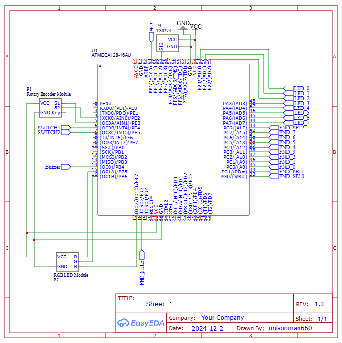

# Introduction
This project is from Microcessor Design class at the University of Seoul. Developed with JKit-128-1.

This project is mood light with convenient features such as:
1. Outside light detection: Mood light turns on when day->night and turns off when night->day.
2. Double clap detection: Mood light toggles on user's double clap.
3. Sound threshold adjustment: User can adjust the threshold sound value. Every sound bigger than the threshold is checked whether it is a doble clap.

# Demo

https://github.com/user-attachments/assets/2c43986f-2cbc-41b9-9489-d0dff180075a

# Configuration & Build
1. Setup hardware
    
    - Board: JKit-128-1
    - Paripararls

        | Component Name       | Prefix | Manufacturer |
        |---------------------|--------|--------------|
        | Rotary Encoder       | P1     | SunFounder   |
        | RGB LED Module       | P2     | SMG          |
        | Sound Sensor Module (TS0223) | P3     | SMG   


    

2. Install AVR-GCC

    We used `avr-gcc-7.3.0-atmel3.6.1-arduino7-i686-w64-mingw32` compiler which can be downloaded from the link below.

    http://downloads.arduino.cc/tools/avr-gcc-7.3.0-atmel3.6.1-arduino7-i686-w64-mingw32.zip

3. Install make

    We used `make-4.4.1` make program which can be downloaded from the link below.

    https://github.com/xpack-dev-tools/windows-build-tools-xpack/releases/

4. Build project
    ```
    mkdir build
    cd build
    cmake\
        -DAVR_TOOLCHAIN_DIR=${Fill in path to the folder containing AVR-GCC bin folder}\
        -DCMAKE_MAKE_PROGRAM=${Fill in path to make.exe}\
        ..
    ```

5. Upload the executable to your machine using avrdude

    https://github.com/avrdudes/avrdude


# Code
```

  // State machine that drives the entire system

  // State machine that manages the on/off state of the mood lamp

  // State machine that detects two consecutive claps

┌──────────────────────┬────────┐  // System SM: State machine that configures system
│      Sensor SM       │ System │  // Sensor SM: State machine that reads sensor data from adc
├──────────┬───────────┤   SM   │  // Day SM: State machine that represents whether it is day or night
│ Clap SM  │  Day SM   │        │  // Clap SM: State machine that detects two consecutive claps
├──────────┴───────────┴────────┤
│ Peripheral Drivers            │  // Drivers for each peripheral device
│ (FND, LED8, Timer1, etc.)     │
├──────────────────────┬────────┤
│     Pin Settings     │ System │  // Pin Settings: definitions of pin configuration for each peripheral on the ATmega128
├──────────────────────┤ Config │
│    ATmega128 Lib     │        │  // System Config: system-level configuration unrelated to pin settings
└──────────────────────┴────────┘
```